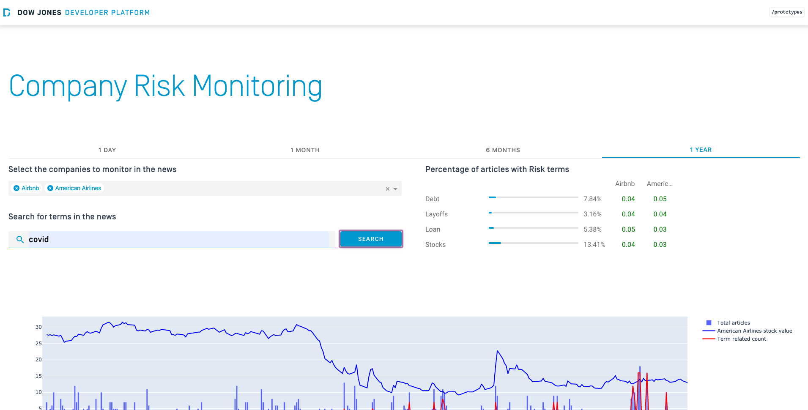

# Elasticsearch Dashboard Example

The purpose of the dashboard app in this repository is to read snapshot data loaded into Elasticsearch. The app includes the following features:
* Plot that shows article counts per day
* Free search
* Article preview

Additional scripts are present to create and download snapshots files, as well as to load and enrich the files in Elasticsearch.

## Overview
#### General view


#### Top hits view


#### Article preview


## Dependencies

### Library Dependencies for Python.

`requirements.txt` lists these dependencies.

### [djdna_common](https://github.com/miballe/djdna_common) Library Methods

The **djdna_common** library is a set of widely used methods that eases operations such as reading DNA Snapshots AVRO files or interacting with Elasticsearch. The methods in the set don't have robust code to validate unexpected cases or to handle exceptions; their purpose is merely illustrative. For such reason, the library is not available as a Python package. However, it is present throughout many Dow Jones DNA examples.

To leverage these methods, follow the next steps:
1. Clone the code in this repository and the code in the djdna_common repository to the same base directory.
2. Create a symbolic link or copy the folder content.

The commands to complete this task look like the ones in the following code snippet:

    ```
    $ git clone https://github.com/miballe/djdna-snapshot2elasticsearch.git
    $ git clone https://github.com/miballe/djdna_common
    $ cd djdna-snapshot2elasticsearch
    $ ln -s ../djdna_common/ djdna_common
    ```

### [factiva_common](https://github.com/dowjones/factiva_common) Library Methods.

To leverage these methods, follow the next steps:
1. Clone the code in the **factiva_common** repository to the same base directory
2. Create a symbolic link or copy the folder content.

The commands to complete this task look like the ones in the following code snippet:

    ```
    $ git clone https://github.com/dowjones/factiva_common
    $ ln -s ../factiva_common/ factiva_common
    ```

### Elasticsearch Server.

To set an Elasticsearch server, please refer to the [official documentation](https://www.elastic.co/guide/en/elasticsearch/reference/current/install-elasticsearch.html).

Before running the application, an index needs to be created. Run the `create_index.py` script to create it. You can choose to create the index manually. If so, add the mapping that is included in `resources/files/dna-es-mappings.json`.

### CoreNLP Server.

The purpose of this server is to enrich the contents before loading them into Elastisearch. 

To set a CoreNLP Server, please refer to the [official website](https://stanfordnlp.github.io/CoreNLP/corenlp-server.html).

## Running the application

1. Fill out the `config/env.py` file.

2. Set up the desired snapshot files and download the resulting articles.

    1. If you don’t have a snapshot, add the query to the `resources/create-snapshot.py`. Then run the following command which will create the snapshot and download the files to your local machine: 
    ```
    python -m resources.create-snapshot
    ```

    2. If you have a snapshot, run the following command which will download the files for the `snapshot_id` specified on the `config/env.py` to your local machine:
    ````
    python -m resources.article-download
    ````

3. Create the Elasticsearch index by running:
    ```
    python -m resources.create-index
    ```

You can choose to create the index manually. If so, remember to add the mapping included in `resources/files/dna-es-mappings.json`.

4. Load the data into Elasticsearch by running:
    ```
    python -m resources.load-dna-data
    ```

5. Run the app with `main.py`.
